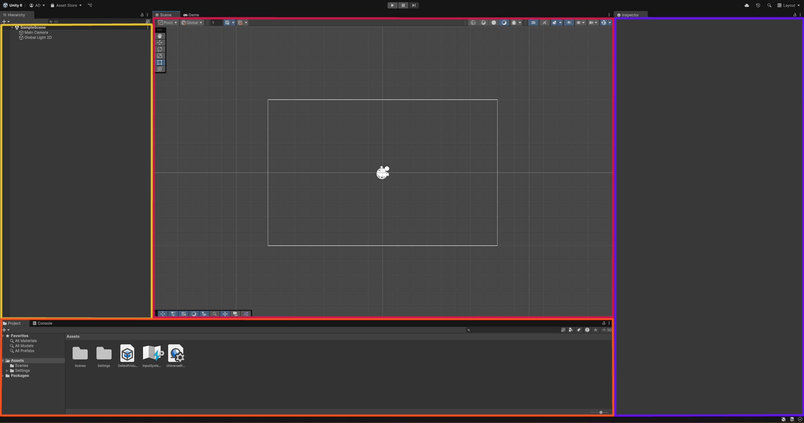
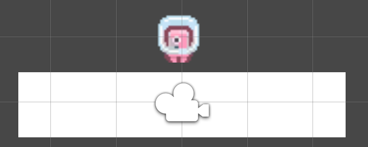
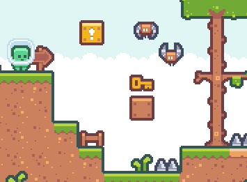

# My first Platformer in Unity

## 0. Before the course

[Install Unity Hub](https://unity.com/download)

You are good to go !

## 1. The Editor

Start Unity Hub, then select `New Project -> Universal 2D -> Create Project`



You should now be presented with this editor:

- YELLOW: The inspector, allowing you to see and access all the objects in your current scene.
- ORANGE: The project assets, allowing you to interact with your game's files like images or sound.
- RED: The scene, allowing you see and interact with the objects of your scene. It is where you build your levels.
- PURPLE: The object inspector, allowing you to see and set the selected object's components.

## 2. Making our level

### 2.1 The Platform

Let's add a platform for our player to stand on, simply right click on the `Hierarchy` window and select `2D Object->Sprites->Square`

We can widen the platform by selecting it in the `Hierarchy` and setting it's scale accordingly.

### 2.2 The Player

We will need an appropriate sprite for our Player, you can use the ones included in this repository's `Ressources` folder by simply dragging in into your `Project` window.

Once imported, you can add a sprite to your scene by dragging it into your `Scene`.

You should now have your player on top of an adequate platform:



## 3. Physics and Colliders

### 3.1 Gravity

Right now our scene is completely static.

We can make the player be affected by gravity by adding a Rigidbody 2D to it by selecting it and pressing `Add Component->Rigidbody 2D` in the `Inspector` window.

We can test it by pressing the `Play` button that is on top of our `Scene` window.

### 3.2 Collisions

We should observe the player phasing through the platform.

That is because we have not specificied any colliders for our objects.

Colliders (aka Hitboxes) are what defines the shape that our object will interact the world with.

We should add colliders by adding the `Box Collider2D` component to both the player and the platform.

If you `Play` the scene again, the player should be able to stand on the platform.

## 4. Scripting

### 4.1 Creation

After all this work, we can finally start scripting our character.

To add a script to an object, simply select it and `Add Component->New Script->Movement`

You can then right click then `Edit Script` to load it into your code editor.

### 4.2 The Script

Unity scripts are written in C#, so I hope the syntax is not too diffamiliar.

We can see that all of the logic resides inside the Movement `Class` which inherits from `MonoBehavior`

This inheritance gives it access to two methods:
- Start: This method will be called when you press the `Play` button, it is useful for initilization.
- Update: This method will be called every frame, it is useful for dynamic systems and handling inputs.

To check if everything is working correctly, use Unity's ```Debug.Log``` method to print "Hello" at the start of the game and "Update" every frame.

The logs should appear in the `Console` window.

### 4.3 Inputs

Unity uses a built-in class named `Input` to expose booleans represented the inputs states.

For example, `Input.GetKeyDown(KeyCode.Z)` will return true only for the frame the Z key was pressed.

`Input.GetKey(KeyCode.Z)` does the same except it remains true as long as the key is pressed.

Modify the script so that is logs `Tap` when you press the spacebar and `Hold` when you hold it.

### 4.4 Movement

If we want to move our character, we will need to access it's velocity, which is managed by our `Rigidbody 2D` component.

To access the component, we can use Unity's `GetComponent<INSERT_COMPONENT_TYPE>()` method that will return the component.

We can then call `AddForce(force)` to apply a force to the rigidbody (ex: `.AddForce(new Vector3(0, 100, 0))`) to add a large force to the Y axis.

Another option is to directly set the velocity by accessing the `velocity` field. [Rigidbody 2D Documentation](https://docs.unity3d.com/ScriptReference/Rigidbody2D.html)


You should be able to combine this new knowledge to get the player to jump when you press the spacebar, and move left and right with Q/D.

## 5. What's next

Now that you have a working player character, you can make anything !

Here are some ideas:
- Spikes
- Coins
- Make a level with a start and end
- Enemies
- Powerups


